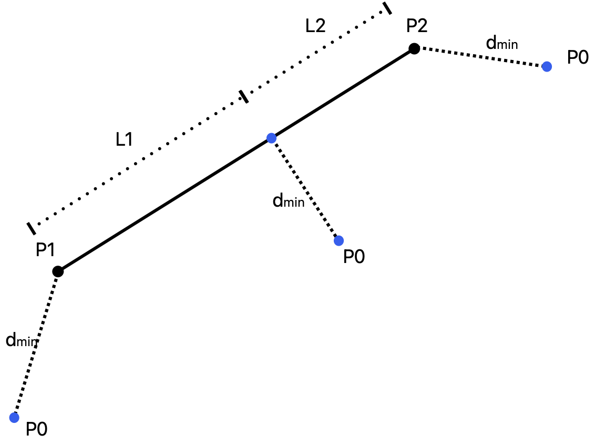

# AMworkflow

## Dev on Documentation
+ Prerequisite: ```Sphinx```, ```sphinx-autobuild```, ```sphinx-rtd-theme```, ```sphinxcontrib-applehelp```, ```sphinxcontrib-devhelp```, ```sphinxcontrib-htmlhelp```, ```sphinxcontrib-jquery```, ```sphinxcontrib-jsmath```, ```sphinxcontrib-qthelp```, ```sphinxcontrib-serializinghtml```.
+ How does it work?
Use the command:

```sphinx-autobuild . _build/html```

The server should be ready on Localhost Port 8000 and it auto builds when changes made.


## Introduction
Some Intro

## Project Organization
```bash
.
├── config
│   └── settings.py
├── dependencies
│   └── OCCUtils-0.1.dev0-py3-none-any.whl
├── gcode
│   ├── config
│   │   ├── ConcretePrinter.yaml
│   │   ├── ConcretePrinter_BAM.yaml
│   │   ├── PowderBedBAM.yaml
│   │   ├── RS-274D_config.ini
│   │   └── RepRap.yaml
│   ├── gcode.py
│   └── printer_config.py
├── geometry
│   ├── builtinCAD.py
│   └── geometry.py
├── meshing
│   └── meshing.py
├── occ_helpers.py
└── simulation
    ├── experiment.py
    ├── simulation.py
    └── tests
```

## BuiltinCAD

* **Shortest_distance_point_line**

The function returns the shortest distance between a point and a line (segment). For example in figure above the result will be $(\frac{L_1}{L_1+L_2},d_{min})$.

```{eval-rst}
.. autofunction:: amworkflow.geometry.builtinCAD.shortest_distance_point_line
```


<!-- Only A template to show how do you write equations here -->
<!-- ```{math}
e^{i\pi} + 1 = 0
``` --> 

```{eval-rst}
.. automodule:: amworkflow.geometry.builtinCAD
   :members:
   :exclude-members: CreateWallByPoints, shortest_distance_point_line
```

## Gcode
```{eval-rst}
.. automodule:: amworkflow.gcode.gcode
   :members:
```

## Geometry

```{eval-rst}
.. automodule:: amworkflow.geometry.geometry
   :members:
```

## Meshing

```{eval-rst}
.. automodule:: amworkflow.meshing.meshing
   :members:
```

## Simulation

```{eval-rst}
.. automodule:: amworkflow.simulation.simulation
   :members:
```

## Experiment

```{eval-rst}
.. automodule:: amworkflow.simulation.experiment
   :members:
```